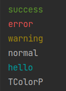

# TColorP

[](https://www.python.org/)   

print with color.

```python
from TColorP import TColorP, TColor

tcp = TColorP()
tcp.success('success')
tcp.error('error')
tcp.warning('warning')
tcp.normal('normal')

tcp.formatColor([TColor.method_normal, TColor.foreground_cyan])
print('hello')
tcp.formatColor([TColor.method_normal])
print('TColorP')
```




## License

MIT License,Thanks!